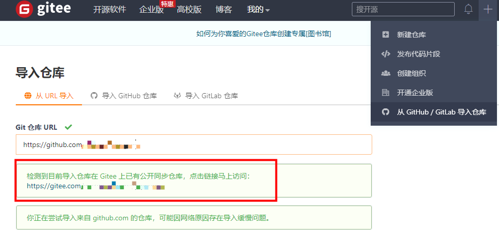

+++
title = "Github访问慢？"
date = 2021-04-01T10:33:40+08:00
draft = false
slug = "a84ac7fa"
author = "Chris-dc"
description = "Github访问慢问题，及解决方案"
summary = "Github访问慢问题，以及一些常规的解决方案"
include_toc = true
show_comments = false
+++


作为开发者，GitHub常用网站之一。但如果没有 “科学上网”，查看访问网站可能很慢，甚至无法访问呢，几天就针对此问题，列举一些解决方案。


速度慢的原因有很多，但最直接和最主要的原因是 GitHub 的分发加速网络的域名遭到 DNS 污染。

由于 GitHub 的加速分发 CDN 域名 assets-cdn.github.com 遭到 DNS 污染，导致无法连接使用 GitHub的加速分发服务器，才使得中国大陆访问速度很慢。


## 解决方案

### 修改hosts

我们解决污染问题一般是通过修改 Hosts ，GitHub 的 CDN 域名被污染问题也不例外。将域名解析直接指向 IP 地址来绕过 DNS 的解析，以此解决污染问题。


通过域名DNS查询网站，查询对应域名的IP（www.ipaddress.com / http://tool.chinaz.com/dns）

常用网站(其他的根据情况自行补充)

```
github.com
assets-cdn.github.com
global.ssl.fastly.net
codeload.github.com
raw.githubusercontent.com
gist.githubusercontent.com
```

找到hosts文件修改(不要复制粘贴，根据自己的查询情况填写，以下仅为格式示例。)

```
# GitHub Hosts Start
140.82.114.3：github.com
185.199.108.153：assets-cdn.github.com
185.199.109.153：codeload.github.com
151.101.100.133 raw.githubusercontent.com
151.101.100.133 gist.githubusercontent.com
# GitHub Hosts End
```

*如果某天发现又变慢了，请重新查询以上地址，修改hosts*

#### Windows 系统

1. 文件路径 `C:\Windows\System32\drivers\etc`

2. 在文件最后加上几个域名对应的 IP（此时可能需要管理员权限,可以将hosts复制到桌面，修改好了再复制回去覆盖原先的）。

3. 然后 win + R 输入 cmd，打开命令行界面。输入 `ipconfig /flushdns` 刷新 DNS 缓存即可

#### Mac / Linux 系统

1. 文件路径 `/etc/hosts`

2. 命令行(Terminal)输入命令修改(需要管理员权限) `sudo vi /etc/hosts`。
3. 命令行输入命令刷新DNS缓存

##### MAC

`sudo killall -HUP mDNSResponder`，不同版本可能有所差异根据自己的mac版本自行百度。

##### Linux

现在很多Linux发行版都没有内置DNS本地缓存，Linux不像Windows那样可以使用ipconfig /flushdns来刷新，在Linux下无需刷新，因为本身没有缓存；

当然，如果非要缓存刷新，可以安装nscd，然后刷新这个守护进程。

Ubuntu：

`apt-get install -y nscd`

CentOS:

`yum install -y nscd`

使用：

`service nscd restart`

*其他版本请自行百度确认*


### GitHub 克隆网站

下面这两个网站是 GitHub 的克隆版，也就是该网站的镜像。当你下载、克隆很慢时，可以随意访问下面这俩网站，我试了一下，用这两个网站下载和访问块多了。

- https://github.com.cnpmjs.org
- https://hub.fastgit.org - 推荐


### 项目加速下载网站

下面这个网站是一个 GitHub 加速下载网站，打开你要下载的 GitHub 仓库页面，点击右侧额绿色按钮点击 Download ZIP，等浏览器弹出下载框后复制下载框中的链接地址粘贴到这个网站即可。

http://toolwa.com/github/


### Github国内备用网站 Gitee

通过gitee新建项目

新建 -> 从GitHub/GitLab导入仓库 -> 输入仓库URL

系统会自行检测，如果需要的仓库已存在同步仓库，会有如下红框中提示（可以直接查看对应的镜像地址，或者继续新建）


